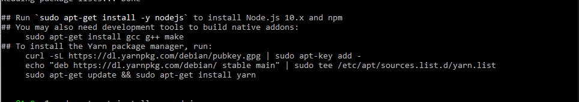

# Dependencies

## 1. npm 

`sudo apt install npm`

## 2. nodejs 

For nodejs follow this link, [Installing nodejs on Ubuntu](https://linuxize.com/post/how-to-install-node-js-on-ubuntu-18.04/)

`curl -sL https://dl.yarnpkg.com/debian/pubkey.gpg | sudo apt-key add -`

`echo "deb https://dl.yarnpkg.com/debian/ stable main" | sudo tee /etc/apt/sources.list.d/yarn.list`

`
